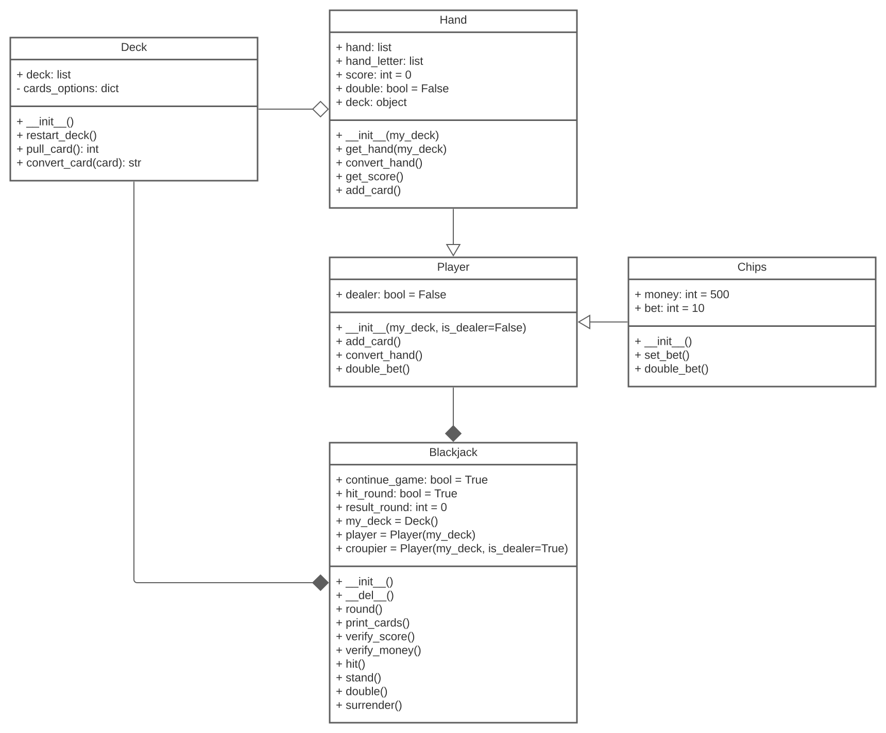

# Blackjack

Blackjack is a casino banking game. The most widely played casino banking game in the world, it uses decks of 52 cards and descends from a global family of casino banking games known as Twenty-One.

## Rules

This game has a point system where all cards in the deck have a numerical value. Each player is dealt two cards, including the dealer.

The object of the game is to win money by creating card totals higher than those of the dealer's hand but not exceeding 21, or by stopping at a total in the hope that dealer will bust.

Number cards count as their number, the jack, queen, and king ("face cards" or "pictures") count as 10, and aces count as either 1 or 11 according to the player's choice. If the total exceeds 21 points, it busts, and all bets on it immediately lose.

A game of blackjack starts with each player placing their bets on the table.

The player will receive two initial cards, which will be face up, showing the value.

The dealer will also be dealt two cards, one face up and the other face down. The face down card is called a "hole card".

After the initial two cards, the player has up to four options:

- Hit: Take another card.
- Stand: Take no more cards.
- Double down: Increase the initial bet by 100% and take exactly one more card. The additional bet is placed next to the original bet.
- Surrender: Forfeit half the bet and end the hand immediately.

## Code

---

Credits: [Wikipedia](https://en.wikipedia.org/wiki/Blackjack).
